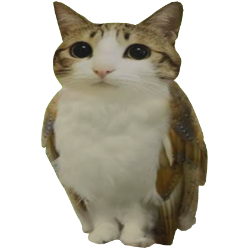

# Meowl 🦉

Petit compagnon de bureau Linux qui compte les mots que vous tapez. Meowl s'installe en bas à droite de votre écran, reste au-dessus de toutes les fenêtres et s'agite joyeusement à chaque mot.



## Pré-requis

- Linux (KDE Plasma 6 recommandé, X11 ou Wayland)
- `pnpm`, `cargo`, toolchain Rust
- Les dépendances système de Tauri (`webkit2gtk`, `gtk3`, etc.)
- XWayland si vous utilisez Wayland
- Votre utilisateur doit appartenir au groupe `input` :

```sh
sudo usermod -aG input $USER
# puis se déconnecter / reconnecter
```

## Build

```sh
pnpm install
pnpm tauri build
```

Le binaire se trouve dans `src-tauri/target/release/meowl-pet`.

Pour lancer en mode développement :

```sh
pnpm tauri dev
```

## Lancement automatique avec systemd

Créez le fichier `~/.config/systemd/user/meowl-pet.service` :

```ini
[Unit]
Description=Meowl desktop pet
After=graphical-session.target
PartOf=graphical-session.target

[Service]
ExecStart=/home/%u/.local/bin/meowl-pet
Restart=on-failure

[Install]
WantedBy=graphical-session.target
```

Copiez d'abord le binaire au bon endroit :

```sh
cp src-tauri/target/release/meowl-pet ~/.local/bin/
```

Puis activez le service :

```sh
systemctl --user daemon-reload
systemctl --user enable --now meowl-pet
```

Pour consulter les logs :

```sh
journalctl --user -u meowl-pet -f
```

## Licence

[MIT](LICENSE)
